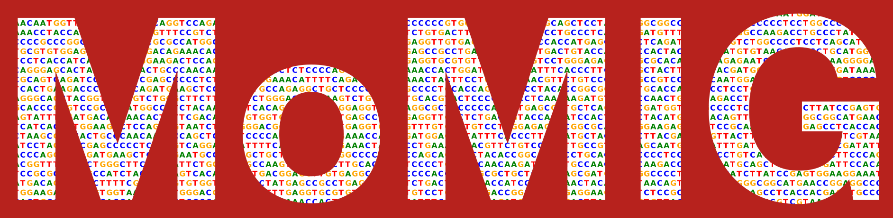
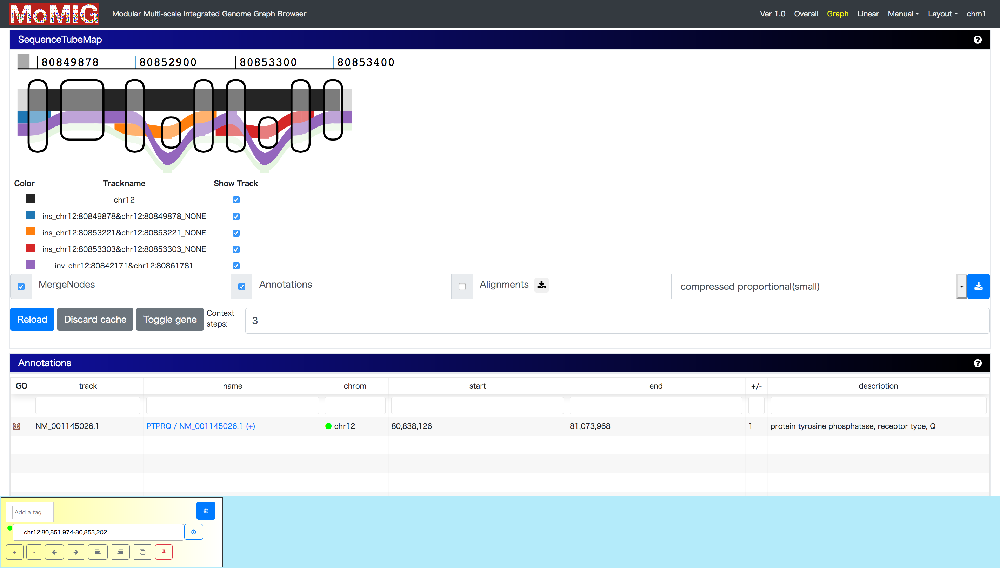
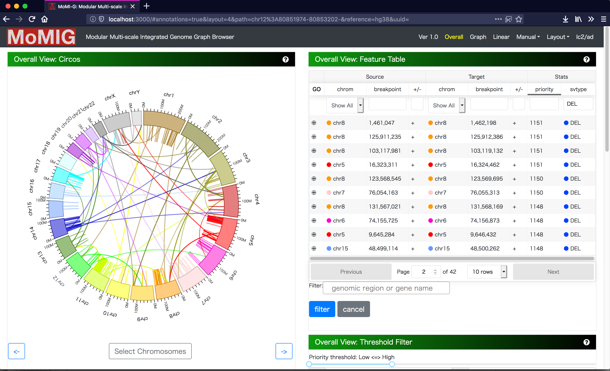
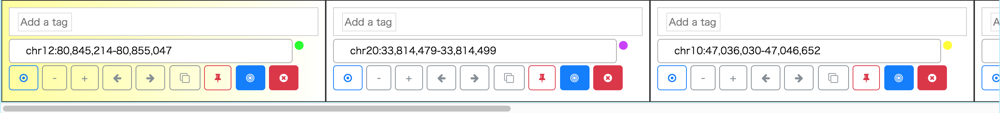
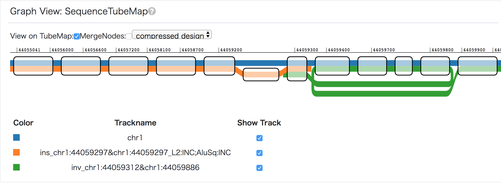

# MoMI-G

[ ](https://app.codeship.com/projects/245600) [](https://microbadger.com/images/momigteam/momig-backend "Get your own version badge on microbadger.com")

## Modular Multi-scale Integrated Genome Graph Browser



A genome graph browser for visualization of structural variants (SVs) as a variation graph:

Long-read sequencing allows for more sensitive and accurate discovery of SVs, which requires to filter and validate thousands of candidates. Since most visualization tools show an only range of a linear sequence, making them unsuitable for large (over megabase) or nested SVs. Also, manual screening for SV candidates is still important because of high false positive rate of SV calling. Here we present MoMI-G, a graph genome browser to visualize SVs on the variation graph, which is composed with reference genome and variations. Users can filter SVs, visualize with genomic annotations, and validate using read alignments.

## Demo

Youtube Movies: [Short Demo](https://youtu.be/Cv1OFREYtbU), [Short Demo 2](https://youtu.be/mEXpFwf1K_M)

Demo Page: [CHM1 Demo](http://demo.momig.tokyo/)



## Installation
### Dependencies

* Node.js
* npm or yarn
  * Docker (optional)

### Summary of set up

``` bash
$ git clone https://github.com/MoMI-G/MoMI-G
$ cd MoMI-G
$ yarn
$ yarn start
```

And access to http://localhost:3000/. The demo shows CHM1, a human hydatidiform mole cell line dataset from backend server of MoMI-G that MoMI-G developer serves.

### Run on your workstation

If you want to run the backend server on your laptop, modify `package.json` and run docker container which includes backend server and CHM1 chr21 with simulated reads dataset.

``` bash
$ sed -e "s/\"target/\"target_/g"  -e "s/\_target/target/g" -i.bak package.json
$ yarn start
$ docker run --init -p 8081:8081 momigteam/momig-backend # Run it on another shell. It takes a little long time -- please wait.
```

You can start docker container by `docker-compose up` instead of `docker run`. The source code of the backend server is [here](https://github.com/MoMI-G/MoMI-G_backend).

## Features

MoMI-G

* allows visualization of (possibly distant) multiple intervals.
* displays SVs that span multiple intervals.
* displays SVs at varying scales, i.e., chromosome, gene, and nucleotide scales.
* allows users to manually inspect hundreds of SVs.

## Usage

### Select structural variants



Manual screening for all SVs is time-consuming so that SVs should be filtered by certain criteria for manual screening. There are two view components to select SVs from candidates. The first view components is Circos, which aligns chromosomes as a circular layout. Thick arcs are chromosomes, and a line connecting to thick arcs indicates a SV. Because Circos enables us to choose and rotate chromosomes, we can focus on the subset of chromosomes. Circos is a suitable for visualizing the distribution of SVs and inter-chromosomal variations as lines. Second, Feature Table shows chromosome names, coordinates, and strand, enabling us to select SVs. We can sort and filter Feature Table by SV type, coordinates, or gene name. We can select a SV from both components.

### Interval Card Deck



After you select SVs using Feature Table or Circos Plot, the listed variants are stacked on Interval Card Deck at the bottom of the window. In Interval Card Deck, intervals are displayed as cards, and the interval of the top (leftmost) card of the deck is shown on SequenceTubeMap. Each card can be dragged, and the order of cards can be changed. If one double-clicks on a card, the card moves to the top of the deck. Also, a card can be locked to avoid unintended modification or disposal, and the gene name can be input with autocompletion for specifying the interval of a card.

### Visualize as genome graphs



We integrate SequenceTubeMap into MoMI-G with modifying the original implementation so that it can visualize a variation graph converted from SVs for showing the difference between a reference genome and a personal genome. Because there are many types of paths in variation graph, we categorized them for assigning different design as follows:

* Chromosome Path (thick, grayscale): A chromosome path is a chromosome in a reference genome; walking on the path provides us a full nucleotide sequence.
* Variant Path (colored): A variant path with a variation name represents a personal genome.
* Gene Path (thin, colored): A gene path is for gene annotation. Exons are shown as a path with a darker color, and introns are shown as that with a lighter color.
* Annotation Path (thin, grayscale): An annotation path is for user-definable bigBed annotations such as repeats. If you have a GFF3 or BED file, you can easily convert into bigBed file.
* Read Alignment (thin, grayscale): Read alignments aligned on the graph or lifted over from the original alignments to a reference genome.

A sequence graph as a bi-directed graph composed of a set of multiple DNA sequences as nodes and the corresponding end-to-end connections as edges has the ability to describe duplications, indels and inversions as loops or branching and merging against a reference genome.

### Annotations


Gene annotations retrieved from Ensembl or names of the region described in bigbed format are listed on Annotation Table.

## Dataset

The demo includes the genome of the [CHM1 dataset](http://eichlerlab.gs.washington.edu/publications/chm1-structural-variation/). CHM1 is a human hydatidiform mole cell line dataset so that we can assume all SVs are homozygous. They identified insertions, deletions, and inversions against hg19, so we converted from the list of SVs into a variation graph with our custom scripts. Alternatively, you can employ your own dataset with the following procedure.

### Adapt your own dataset

If you want to run MoMI-G with your own dataset, use our custom scripts `scripts/vcf2xg.sh` to generate pcf and xg dataset. It requires VG, ruby, bash, and samtools.

|Software|Dataset|Supported SV type|
|------|---|----|
|Sniffles|for PacBio/Nanopore|INV, DEL, TRA, DUP, (INS)|
|10X LongRanger|for 10X|To be supported|
|SURVIVOR|for merging SV calls|To be supported|

```bash
$ bash vcf2xg.sh test.vcf test_output /bin/vg hg[19|38]
```

After that, these files are required to be mounted on "static/" folder.

* static/
  * config.yaml: a configuration file
  * \*.xg: an index of variation graph, generated by [vg](https://github.com/vgteam/vg)
  * \*.pcf: pair of cooridnate format: required to display variants on Feature Table or Circos Plot. 
  * \*.gam(optional): read alignments on the graph
  * \*.gam.index(optional): index of gam

``` bash
$ docker run --init -p 8081:8081 -v `pwd`/static:/vg/static momigteam/momig-backend
$ yarn start
```

## Change log

* 2017.08.09 Ver 0.1 (alpha)
* 2017.09.26 Ver 0.2 (deploy CHM1 graph)
* 2017.12.12 Ver 0.3 (beta)
* 2017.12.19 Ver 0.4 (add gene annotations)
* 2018.01.02 Ver 0.5 (add English descriptions)
* 2018.01.11 Ver 0.6 (fix design)
* 2018.01.28 Ver 1.0RC
* 2018.02.10 Ver 1.0
* 2019.01.06 Ver 1.0 Rev.1

## Disclaim

We will not guarantee the accuracy and validity of the output result of this software at all. In addition, we will not assume any responsibility for any damage caused by using this software.

## Acknowledgements

This work is supported in part by Information-technology Promotion Agency, Japan (IPA), Exploratory IT Human Resources Project (The MITOU Program) in the fiscal year 2017.

## References

* Chaisson, M. J. P., Huddleston, J., Dennis, M. Y., Sudmant, P. H., Malig, M., Hormozdiari, F., … Eichler, E. E. (2015). Resolving the complexity of the human genome using single-molecule sequencing. Nature, 517(7536), 608–611. http://doi.org/10.1038/nature13907
* Garrison, E., Novak, A., Hickey, G., Eizenga, J., Dawson, E., Jones, W., … Durbin, R. (2017). Sequence variation aware references and read mapping with vg : the variation graph toolkit. bioRxiv, 1–27. http://doi.org/10.1101/234856
* Beyer, W. SequenceTubeMap, https://github.com/vgteam/sequencetubemap
* Vanderkam, D., Aksoy, B. A., Hodes, I., Perrone, J., & Hammerbacher, J. (2016). pileup.js: a JavaScript library for interactive and in-browser visualization of genomic data. Bioinformatics, 32(March), btw167. http://doi.org/10.1093/bioinformatics/btw167
* Paten, B., Novak, A. M., Garrison, E., & Hickey, G. (2017). Superbubbles, Ultrabubbles and Cacti. bioRxiv, 1–13. http://doi.org/10.1101/101493
* Harrow, J., Frankish, A., Gonzalez, J. M., Tapanari, E., Diekhans, M., Kokocinski, F., … Hubbard, T. J. (2012). GENCODE: The reference human genome annotation for the ENCODE project. Genome Research, 22(9), 1760–1774. https://doi.org/10.1101/gr.135350.111
* TogoGenome. http://togogenome.org/
* DBCLS. (2016). SPARQList https://github.com/dbcls/sparqlist

## License

MIT

