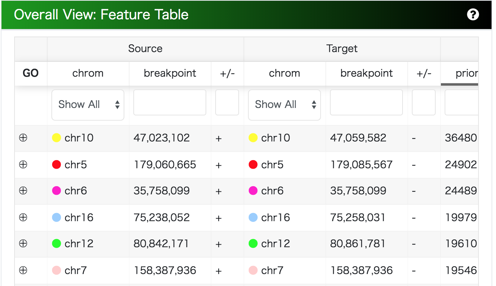
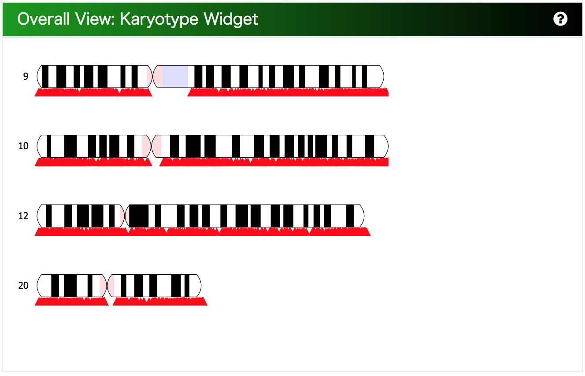

# MoMIG

### Modular Multi-scale Integrated Genome Graph Browser


A genome graph browser for visualization of structural variants as a genome graph:

A sequence graph as a bi-directed graph composed of a set of multiple DNA sequences as nodes and the corresponding end-to-end connections as edges has the ability to describe duplications, indels and inversions as loops or branching and merging against a reference genome.

The visualization of sequence graph which is composed of a reference genome and a personal genome can be useful for the interpretation of structural variants in the personal genome. This genome browser is designed to visualize large-scale structural variants called from personal genomes.

## Goals

* Compare a personal genome to a reference genome
* Reveal nested variations
* Navigate for all structural variations
* Visualize the distributions of structural variations

## Install
### Dependencies

* Node.js
* npm or yarn

### Summary of set up

``` bash
$ git clone https://github.com/MoMI-G/MoMI-G
$ cd MoMI-G
$ yarn
$ yarn start
```

And access to http://localhost:3000/.

The back-end API is defined at https://gbapi4.docs.apiary.io/ (but some definitions are outdated).
The CHM1 dataset is displayed by default. Modify `package.json` if you want to change the data source.

## Features

Multi-scale view modules from whole-genome to a nucleotide are integrated on the dashboard.


* Header: a link to README or options to change layouts.
* Main:
    * Overall View: select structural variations from Circos Plot / SV table / genomic coordinates / gene name
    * Graph View: visualize genome graphs / karyotype on the selected genomic region
    * Linear View: integrate with gene annotations / linear genome browser
* Footer: a workspace -- a list of genomic region -- for comparing between coordinates

## Usage

### Dataset

This demo allows you to visualize the genome information of the [CHM1 dataset](http://eichlerlab.gs.washington.edu/publications/chm1-structural-variation/), human haploid which includes insertions, deletion, and inversions.

This graph is called CHM1 graph below.

### Select structural variants

 

You can select structural variants from Circos plot or table. When you click a line between chromosomes in Circos or "GO" button of a row of the structural variant in the table, the selected region is added into a coordinate workspace on the footer.

### A workspace for genomic regions


When you select a genomic coordinate with the overall view, the region is inserted on the footer workspace and the top item of the workspace is the target of visualization as genome graphs.

Each card is draggable. If you double-clicked each card of genomic coordinate, then the item moves to the top of the list. You can name the genomic region and you can also lock the region. Moreover, you can specify the genomic region or gene name on the card.

### Karyotypes



Karyotypes of each chromosome which is listed in the workspace is shown in this component. The red pictogram means that structural variations are identified on the position.

### Visualize as genome graphs


The genomic region on the reference genome is drawn as a genome graph:

* Node: a multiple DNA sequence
  * The length of a node is proportional to the length of the DNA sequence.
* Chromosome Path(widest, grayscale): an ordered set of DNA sequence -- Tracing the path marked with the chromosome name shows that the nodes are included in the reference genome in that order.
* Variant Path(colorful): Tracing the path marked with the variation name shows that the nodes are included in the personal genome in that order.
* RefSeq Path(narrowest, green): A gene annotation, dense areas are exons, thin areas are introns.

### Confirm gene annotations


This is the RefSeq gene list of the selected genomic coordinate.

## Change log

* 2017.08.09 Ver 0.1 (alpha)
* 2017.09.26 Ver 0.2 (deploy CHM1 graph)
* 2017.12.12 Ver 0.3 (beta)
* 2017.12.19 Ver 0.4 (add gene annotations)
* 2018.01.02 Ver 0.5 (add English descriptions)
* 2018.01.11 Ver 0.6 (fix design)
* 2018.01.28 Ver 1.0RC
* 2018.02.10 Ver 1.0

## Disclaim

We will not guarantee the accuracy and validity of the output result of this software at all. In addition, we will not assume any responsibility for any damage caused by using this software.

## Acknowledgements

This work is supported by Information-technology Promotion Agency, Japan (IPA), Exploratory IT Human Resources Project (The MITOU Program) in the fiscal year 2017.

## References

* Chaisson, M. J. P., Huddleston, J., Dennis, M. Y., Sudmant, P. H., Malig, M., Hormozdiari, F., … Eichler, E. E. (2015). Resolving the complexity of the human genome using single-molecule sequencing. Nature, 517(7536), 608–611. http://doi.org/10.1038/nature13907
* Garrison, E., Novak, A., Hickey, G., Eizenga, J., Dawson, E., Jones, W., … Durbin, R. (2017). Sequence variation aware references and read mapping with vg : the variation graph toolkit. bioRxiv, 1–27. http://doi.org/10.1101/234856
* Beyer, W. SequenceTubeMap, https://github.com/vgteam/sequencetubemap
* Vanderkam, D., Aksoy, B. A., Hodes, I., Perrone, J., & Hammerbacher, J. (2016). pileup.js: a JavaScript library for interactive and in-browser visualization of genomic data. Bioinformatics, 32(March), btw167. http://doi.org/10.1093/bioinformatics/btw167
* Paten, B., Novak, A. M., Garrison, E., & Hickey, G. (2017). Superbubbles, Ultrabubbles and Cacti. bioRxiv, 1–13. http://doi.org/10.1101/101493
* O’Leary, N. A., Wright, M. W., Brister, J. R., Ciufo, S., Haddad, D., McVeigh, R., … Pruitt, K. D. (2016). Reference sequence (RefSeq) database at NCBI: Current status, taxonomic expansion, and functional annotation. Nucleic Acids Research, 44(D1), D733–D745. https://doi.org/10.1093/nar/gkv1189
* Harrow, J., Frankish, A., Gonzalez, J. M., Tapanari, E., Diekhans, M., Kokocinski, F., … Hubbard, T. J. (2012). GENCODE: The reference human genome annotation for the ENCODE project. Genome Research, 22(9), 1760–1774. https://doi.org/10.1101/gr.135350.111
* TogoGenome. http://togogenome.org/
* DBCLS. (2016). SPARQList https://github.com/dbcls/sparqlist
